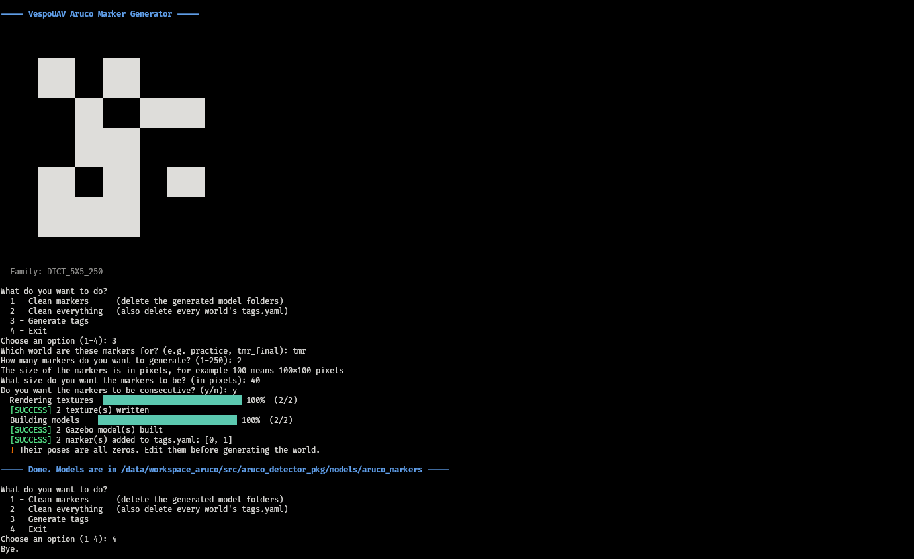

# VespoUAV ArUco Toolkit

Tooling to generate ArUco markers as ready-to-use Gazebo Harmonic models for the
VespoUAV autonomous drone team, following TMR (Torneo Mexicano de Robótica)
specifications.

The toolkit takes care of three things:

1. Rendering the marker images (PNG textures).
2. Wrapping each marker in a complete Gazebo model (`model.config` + `model.sdf`).
3. Registering the markers of a world in a `tags.yaml` file you edit by hand with
   the real coordinates.



---

## Table of Contents

- [Requirements](#requirements)
- [Installation](#installation)
- [Quick start](#quick-start)
- [Usage](#usage)
- [Project structure](#project-structure)
- [How it works](#how-it-works)
- [Using the models in Gazebo](#using-the-models-in-gazebo)
- [Technical details](#technical-details)
- [Troubleshooting](#troubleshooting)
- [Author](#author)

---

## Requirements

- **Python 3.10 or higher**
- **OpenCV (cv2)** with the `aruco` contrib module
- **PyYAML** (already installed with ROS 2)
- **Gazebo Harmonic** (`gz sim`)
- **ROS 2 Humble** with `ros-humble-cv-bridge` (for the detection side)

---

## Installation

### Step 1: Install Python dependencies

```bash
pip install opencv-python opencv-contrib-python
```

Verify the installation:

```bash
python3 -c "import cv2, cv2.aruco, yaml; print('OpenCV:', cv2.__version__)"
```

### Step 2: Go to the package

```bash
cd /data/workspace_aruco/src/aruco_detector_pkg
```

### Step 3: Make the entry point executable

```bash
chmod +x scripts/aruco_generator.py
```

Only `aruco_generator.py` is executable. Every other file in `scripts/` is a
module that gets imported, never run directly.

---

## Quick start

```bash
./scripts/aruco_generator.py
```

Choose option `3`, answer the questions, and you get one Gazebo model folder per
marker plus a `tags.yaml` for your world.

---

## Usage

### Main menu

```
What do you want to do?
  1 - Clean markers      (delete the generated model folders)
  2 - Clean everything   (also delete every world's tags.yaml)
  3 - Generate tags
  4 - Exit
```

The menu loops, so you can clean and then generate without relaunching.

Both clean options list exactly what they are about to delete and require an
explicit `y` to proceed. Option `2` asks twice: once for the models (all
generated, nothing is lost) and once for the `tags.yaml` files (these hold the
poses you edited by hand).

### Generating markers

Option `3` asks four questions:

**Which world are these markers for?**
A short name with no spaces or slashes, e.g. `practice` or `tmr_final`. It
becomes a folder under `worlds/`, and each world keeps its own `tags.yaml`, so
the same marker can be placed differently in different worlds.

**How many markers do you want to generate?**
Between 1 and 250.

**What size do you want the markers to be (in pixels)?**
Resolution of the PNG texture. 200 is a good default. This is the image
resolution, not the physical size of the tag in the simulation.

**Do you want the markers to be consecutive?**
`y` generates IDs 0, 1, 2, ... `n` lets you type the exact IDs separated by
commas, e.g. `0, 100, 249`.

Validation on specific IDs: every ID must be within the dictionary range, no
duplicates are allowed, and the amount must match what you answered in the
second question.

### What gets generated

For each marker ID, a complete Gazebo model:

```
models/aruco_markers/arucotag_100/
├── arucotag_100.png    the texture
├── model.config        metadata Gazebo needs to recognise the folder
└── model.sdf           the geometry, a 0.20 m plane with the texture on it
```

And in the world folder:

```
worlds/practice/
└── tags.yaml           which markers this world has, and where each one goes
```

### Editing tags.yaml

`tags.yaml` is generated with every pose set to zeros. Those are placeholders,
not real positions:

```yaml
markers:
  - id: 0
    pose: [0.0, 0.0, 0.0, 0.0, 0.0, 0.0]
  - id: 100
    pose: [0.0, 0.0, 0.0, 0.0, 0.0, 0.0]
```

A pose is `[x, y, z, roll, pitch, yaw]` — position in meters, rotation in
radians. A marker lying flat on the floor needs no rotation. A marker on a wall
needs `roll = 1.5708` (90 degrees), and `yaw` decides which way it faces.

**Re-running the generator preserves your edits.** Markers already listed keep
their pose, only brand new IDs are appended with zeros, and nothing is ever
removed. Comments you add to the file are lost on regeneration, though.

---

## Project structure

```
aruco_detector_pkg/
├── scripts/
│   ├── aruco_generator.py     entry point, the interactive menu
│   ├── aruco_paths.py         every path and naming convention
│   ├── aruco_img.py           ArUco dictionary and PNG rendering
│   ├── aruco_model.py         renders model.config and model.sdf
│   ├── aruco_yaml.py          reads and writes each world's tags.yaml
│   ├── aruco_clean.py         safe deletion of generated artifacts
│   └── aruco_ui.py            colours, status lines and progress bar
├── aruco_template/
│   ├── config.template        skeleton of a model.config
│   └── sdf.template           skeleton of a model.sdf
├── models/
│   └── aruco_markers/         GENERATED, one folder per marker
│       └── arucotag_<id>/
├── worlds/
│   └── <world_name>/
│       └── tags.yaml          GENERATED once, then edited by hand
├── launch/
├── README.md
└── LICENSE
```

Everything under `models/aruco_markers/` is generated and git-ignored on
purpose: each team member runs the generator themselves rather than pulling
binary assets from the repo.

---

## How it works

### Why one folder per marker

Gazebo resolves `model://arucotag_100` by looking for a **folder** with that
exact name. SDF has no variables, so a marker with a different texture is a
different model. Hence one folder, one `model.config`, one `model.sdf` per ID.

### Why paths live in one module

`aruco_paths.py` is the single source of truth: the folder name, the model name,
the texture file name and the `model://` URI all derive from `MARKER_PREFIX` and
the marker ID. The templates receive `{model_name}` and `{texture_uri}` already
built, so the naming can never drift apart between the XML and the filesystem.

### Why the size is a constant

`MARKER_SIZE_METERS = 0.20`, fixed by the rulebook. It is deliberately *not* a
per-world setting: a marker has a single `model.sdf` on disk, so it cannot be
20 cm in one world and 50 cm in another. The pose, which does live per world, is
in `tags.yaml`.

### Separation of concerns

| Where | Decides |
|---|---|
| `model.sdf` | what the tag **is** — size, material, texture |
| `tags.yaml` → world file | where the tag **is** — position and orientation |

The `<pose>` inside `model.sdf` is fixed at `0 0 0.001 0 0 0`. That 1 mm offset
avoids z-fighting (the flicker you get when two surfaces are exactly coplanar).
Poses compose, so placing the model at `3 2 1.6` in the world puts the tag there
with the millimetre of clearance already included.

---

## Using the models in Gazebo

Gazebo looks for models as **direct children** of the paths in
`GZ_SIM_RESOURCE_PATH`, so point it at `models/aruco_markers`, not at `models`:

```bash
export GZ_SIM_RESOURCE_PATH=$GZ_SIM_RESOURCE_PATH:/data/workspace_aruco/src/aruco_detector_pkg/models/aruco_markers
```

Then a world can include a marker with:

```xml
<include>
  <uri>model://arucotag_100</uri>
  <pose>3 2 1.6 1.5708 0 0</pose>
</include>
```

Add the export to your `~/.bashrc` so it survives new terminals.

---

## Technical details

### ArUco family

- **Dictionary:** `DICT_5X5_250`
- **Valid IDs:** 0 to 249
- **Pattern:** 5×5 bits

The rulebook mandates a 5×5 pattern and refers to marker ID **100**. That ID does
not exist in `DICT_5X5_100`, which only goes up to 99 — hence `DICT_5X5_250`.

> **Verify this before the competition.** The same 5×5 grid encodes a given ID
> differently depending on dictionary size, so ID 100 in `DICT_5X5_250` is not
> the same image as ID 100 in `DICT_5X5_1000`. Compare a generated marker
> against the image printed in the rulebook.

To switch dictionaries, edit `FAMILY_NAME`, `FAMILY_SIZE` and the call in
`get_aruco_dictionary()` in `aruco_img.py`. Every prompt and validation derives
from those constants.

### Marker geometry

The model is a `<plane>` rather than a `<box>`. A plane maps the texture cleanly
corner to corner; a box has limited UV coordinates and can stretch or repeat the
image across faces.

A plane is single-sided: seen from behind it disappears. If a wall-mounted tag
is invisible, the rotation is probably 180 degrees off.

### TMR mission context

Mission 2 places a 20 cm × 20 cm ArUco marker next to the left border of a
whiteboard, at a height of 1.6 m, as an optional visual reference for locating
the board. A 20 cm tag is considerably harder to detect than a larger one, so
it is worth measuring at what distance detection starts to fail in simulation.

---

## Troubleshooting

### `ModuleNotFoundError: No module named 'aruco_...'`

A module is missing from `scripts/`, or its filename does not match the import.
All seven files listed in [Project structure](#project-structure) must be there,
with exactly those names.

### `bad interpreter: /user/bin/env`

Typo in the shebang: it must be `#!/usr/bin/env python3` (`usr`, not `user`).

```bash
sed -i 's|#!/user/bin/env|#!/usr/bin/env|g' scripts/aruco_generator.py
```

### `Permission denied`

```bash
chmod +x scripts/aruco_generator.py
```

### `Template not found: .../config.template`

The `aruco_template/` folder is missing or its files are misnamed. It must sit at
the package root — **not** inside `models/`, where Gazebo would try to read it as
a broken model.

### Gazebo shows a white square instead of the marker

The texture is not resolving. Check that `GZ_SIM_RESOURCE_PATH` points at
`models/aruco_markers`, that the marker folder contains its PNG, and that
`model.sdf` declares `<sdf version='1.9'>` — older SDF versions ignore the
`<pbr>` block entirely.

### The marker is invisible from one side

Expected: the plane is single-sided. Rotate it 180 degrees in `yaw`.

### `KeyError` while generating

A placeholder in a template does not match what the code passes. `config.template`
uses `{model_name}` and `{tag_id}`; `sdf.template` uses `{model_name}`,
`{size_meters}` and `{texture_uri}`.

---

## References

- [OpenCV ArUco detection](https://docs.opencv.org/4.x/d5/dae/tutorial_aruco_detection.html)
- [Gazebo Harmonic documentation](https://gazebosim.org/docs/harmonic)
- [SDFormat specification](http://sdformat.org/spec)
- [PX4 Gazebo simulation](https://docs.px4.io/main/en/sim_gazebo_gz/)
- [TMR Torneo Mexicano de Robótica](https://femexrobotica.org/tmr2026/)

---

## License

MIT. See `LICENSE`.

Part of the VespoUAV autonomous drone team at Tecnológico de Monterrey,
Campus Estado de México.

---

## Author

**Imad Jared Cabrera Trejo**
Team Leader — VespoUAV
Contact: cabreratrejoimadjared@gmail.com